# Sistema de Gestão de Cinema

## Descrição do problema

O sistema tem como objetivo gerenciar a programação de um cinema, permitindo o cadastro de filmes e a criação de sessões associadas a esses filmes.  
Ele representa a base para um sistema de venda de ingressos, focando na organização interna do domínio e nas regras de negócio relacionadas às sessões.
O projeto foi desenvolvido com foco em arquitetura de software, priorizando separação de responsabilidades, modularidade e baixo acoplamento.

---

## Objetivo do sistema

O sistema permite:
- Cadastrar filmes
- Consultar filmes cadastrados
- Criar sessões para filmes
- Listar sessões disponíveis
- Vender ingressos para sessões
- Impedir venda de assentos duplicados para a mesma sessão
- Impedir venda de ingressos para sessões já iniciadas
- O foco está na modelagem correta do domínio e na organização arquitetural, não em funcionalidades completas de negócio (como pagamento).

---

## Estilo arquitetural adotado

O sistema foi desenvolvido como um **monólito modular**, utilizando:
- Separação por domínios de negócio (Movies, Sessions, Tickets)
- Conceitos inspirados em DDD (modelo de domínio rico e separação por contexto)
- Arquitetura em camadas com **Ports and Adapters (Arquitetura Hexagonal)**

Cada módulo possui:
- Camada de domínio (regras de negócio)
- Camada de aplicação (casos de uso)
- Portas (interfaces)
- Adapters (REST e persistência)

---

## Diagrama da arquitetura da aplicação

```
                    +---------------------------+
                    |       REST Controllers    |
                    |      (Movies / Sessions)  |
                    +------------+--------------+
                                 |
                                 v
                    +---------------------------+
                    |       Use Cases           |
                    |---------------------------|
                    | Movies:                   |
                    |  - CreateMovieUseCase     |
                    |  - GetMovieUseCase        |
                    |  - ListMoviesUseCase      |
                    |                           |
                    | Sessions:                 |
                    |  - CreateSessionUseCase   |
                    |  - ListSessionsUseCase    |
                    |                           |
                    | Tickets:                  |
                    |  - SellTicketUseCase      |
                    +------------+--------------+
                                 |
                                 v
                    +---------------------------+
                    |        Domain Layer       |
                    |---------------------------|
                    | Movie                     |
                    | Session                   |
                    | Ticket                    |
                    +------------+--------------+
                                 |
                                 v
                    +---------------------------+
                    |    Ports (Interfaces)     |
                    |---------------------------|
                    | MovieRepositoryPort       |
                    | SessionRepositoryPort     |
                    | MovieQueryPort            |
                    | TicketRepositoryPort      |
                    | SessionQueryPort          |
                    +------------+--------------+
                                 |
                                 v
                    +---------------------------+
                    |    Adapters (Outbound)    |
                    |---------------------------|
                    | JPA Repositories (H2)     |
                    +------------+--------------+
                                 |
                                 v
                    +---------------------------+
                    |       H2 Database         |
                    +---------------------------+

    Comunicação interna entre módulos (dentro do monólito):
    CreateSessionUseCase  --(MovieQueryPort)-->  GetMovieUseCase
    SellTicketUseCase --(SessionQueryPort)--> GetSessionUseCase
    (ligação feita via Bean de configuração do Spring)
```

---

## Infraestrutura — Nginx e Docker

### Diagrama da infraestrutura

```
    ┌───────────┐        ┌──────────────────┐        ┌───────────────────┐
    │  Cliente   │──:80──▶│  Nginx (reverse  │──:8080▶│  Spring Boot API  │
    │ (browser/  │──:443─▶│  proxy + SSL)    │        │  (cinema-api)     │
    │  curl)     │        │                  │        │  H2 em memória    │
    └───────────┘        └──────────────────┘        └───────────────────┘
                               │
                      docker-compose.yml
                      rede: cinema-network
```

O **Nginx** atua como ponto de entrada único do sistema, recebendo todas as requisições dos clientes e encaminhando-as para a API Spring Boot. A porta 8080 da API **não é exposta ao host** — o acesso é feito exclusivamente pelo Nginx (portas 80/443). Ambos os serviços rodam em containers Docker orquestrados via `docker-compose.yml` em uma rede bridge isolada.

### Docker

#### Dockerfile da API (`Dockerfile`)
Multi-stage build:
1. **Estágio de build**: usa `maven:3.9-eclipse-temurin-25` para compilar o projeto
2. **Estágio de runtime**: usa `eclipse-temurin:25-jre` (imagem leve, apenas JRE)

#### Dockerfile do Nginx (`nginx/Dockerfile`)
- Baseado em `nginx:alpine`
- Copia o `nginx.conf` e as páginas de erro customizadas
- Gera certificado SSL self-signed automaticamente via `openssl`

#### docker-compose.yml
- **api**: container Spring Boot, porta 8080 exposta **apenas internamente** na rede Docker (não acessível pelo host)
- **nginx**: container Nginx, portas 80 e 443 expostas para o host
- Rede bridge `cinema-network` para comunicação interna
- Nginx depende (`depends_on`) da API para garantir ordem de inicialização

---

## Principais decisões arquiteturais

### 1. Monólito modular
Foi adotado um monólito modular para manter o sistema em um único processo, reduzindo complexidade de infraestrutura e comunicação distribuída. Essa abordagem permite focar na separação de responsabilidades entre módulos e na qualidade da arquitetura interna.

### 2. Separação por domínios
Os módulos **movies**, **sessions** e **tickets** representam contextos distintos do domínio do cinema. Essa divisão reduz acoplamento, melhora a coesão e permite evolução independente de partes do sistema.

### 3. Ports and Adapters (Arquitetura Hexagonal)
A lógica de negócio foi isolada da infraestrutura por meio de interfaces (ports) e implementações externas (adapters). Isso garante baixo acoplamento com frameworks e facilita testes, manutenção e futuras mudanças tecnológicas.

### 4. Modelo de domínio rico
As entidades de domínio concentram regras e validações essenciais, garantindo que objetos nunca existam em estado inválido. Isso reforça a centralização das regras de negócio na camada de domínio, evitando lógica espalhada pela aplicação.

### 5. Nginx como proxy reverso
O Nginx foi adotado como gateway da aplicação para centralizar funcionalidades cross-cutting (SSL, rate limiting, cache, headers de segurança) fora da aplicação Java. Isso mantém a API focada em regras de negócio e permite configurar segurança e performance na camada de infraestrutura.

### 6. Docker e Docker Compose
A containerização garante reprodutibilidade do ambiente e simplifica o deploy. O Docker Compose orquestra os dois serviços (API + Nginx) com uma rede isolada, facilitando a comunicação interna sem expor a API diretamente.

---

## Alternativas consideradas

| Alternativa | Motivo para não usar |
|-------------|---------------------------------------------------------------------------------------------------------------------------------------------------------------------------------------------------------------------------------------------|
| SOA (Service-Oriented Architecture) | Exigiria comunicação entre serviços separados, aumentando a complexidade de implantação e integração, o que foge do escopo de um projeto individual. Do ponto de vista operacional seria muito complexo pra resolver um problema simples. |
| Microserviços | Introduz complexidade operacional (deploy, rede, resiliência) desnecessária para o tamanho do sistema |
| Arquitetura em camadas tradicional | Aumenta o acoplamento entre regras de negócio e infraestrutura, dificultando testes e evolução do domínio (controller → service → repository → banco). Classe service acaba concentrando demais funcionalidade e acopla muito o sistema |
| CRUD anêmico | É quando a regra fica toda em serviços. Isso deixa as entidades sem comportamento. Da forma que fiz o domínio tem força e independência. |

---

## Impacto das decisões

As escolhas arquiteturais resultaram em:
- Código mais organizado e modular
- Maior facilidade de testes unitários
- Possibilidade de migrar partes do sistema para serviços independentes no futuro
- Separação clara entre regras de negócio e infraestrutura
- Segurança, cache e rate limiting centralizados no Nginx (fora da aplicação)
- Ambiente reproduzível via Docker

---

## Principais regras de negócio implementadas

- Um ingresso não pode ser vendido para uma sessão que já iniciou
- Um mesmo assento não pode ser vendido duas vezes para a mesma sessão
- Uma sessão só pode ser criada para um filme existente
- Entidades do domínio nunca são criadas em estado inválido

---

## Autenticação (JWT)

O sistema utiliza autenticação via **JWT (JSON Web Token)**:
- `POST /auth/login?username=<nome>` — gera e retorna um token JWT
- Endpoints protegidos exigem o header `Authorization: Bearer <token>`
- `GET /movies` é o único endpoint público (não exige token)

---

## Instruções para execução

### Executando com Docker Compose (recomendado)

#### Requisitos
- Docker e Docker Compose instalados

#### Passo a passo

```bash
# 1. Na raiz do projeto (onde está o docker-compose.yml)
cd cinema-management

# 2. Subir os containers (build + execução)
docker compose up --build

# 3. A aplicação estará disponível em:
#    - https://localhost       (Nginx com SSL — certificado self-signed)
#    - http://localhost        (redireciona para HTTPS automaticamente)
#
# Nota: como o certificado é self-signed, use a flag -k no curl
#       ou aceite o aviso no navegador.
```

Para parar os containers:
```bash
docker compose down
```

### Executando localmente (sem Docker)

#### Requisitos
- Java 25 instalado
- Variável de ambiente `JAVA_HOME` apontando para o JDK 25
- O banco H2 é iniciado automaticamente em memória

#### Via terminal
```bash
cd cinema-management
./mvnw spring-boot:run
```

#### Via IDE (IntelliJ IDEA)
1. Abra o projeto como projeto Maven (File > Open...)
2. Configure o JDK 25 em File > Project Structure > Project SDK
3. Execute `CinemaManagementApplication.java`

---

## Endpoints disponíveis

| Método | Rota | Autenticação | Descrição |
|--------|------|:------------:|-----------|
| `POST` | `/auth/login?username=<nome>` | ❌ | Gera token JWT |
| `GET` | `/movies` | ❌ | Lista filmes |
| `GET` | `/movies/{id}` | ✅ | Busca filme por ID |
| `POST` | `/movies` | ✅ | Cadastra filme |
| `GET` | `/sessions` | ✅ | Lista sessões |
| `POST` | `/sessions` | ✅ | Cria sessão |
| `GET` | `/tickets` | ✅ | Lista ingressos |
| `POST` | `/tickets` | ✅ | Compra ingresso |

---

## Requisitos implementados — Testes e evidências

> **Pré-requisito**: suba os containers com `docker compose up --build` e aguarde a inicialização.
> Todos os comandos usam `-k` para aceitar o certificado self-signed.

---

### 3.1 — Reverse Proxy

**O que foi feito:** O Nginx escuta nas portas 80 e 443 e encaminha todas as requisições para a API Spring Boot na porta 8080 interna. A porta 8080 **não é exposta ao host** no `docker-compose.yml` — o acesso em produção é feito exclusivamente pelo proxy.

**Onde está configurado:** `nginx.conf` → bloco `upstream cinema-api` + `proxy_pass`

**Teste — API funciona via localhost (pelo Nginx):**
```bash
curl -k https://localhost/movies
```

**Teste — Porta 8080 não acessível diretamente pelo host:**
```bash
# Deve falhar com "Connection refused", pois a porta 8080 não está mapeada no docker-compose
curl http://localhost:8080/movies
```

**Evidência esperada:**
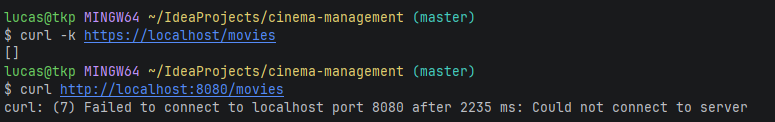

---

### 3.2 — Headers de Segurança

**O que foi feito:** O Nginx adiciona 3 headers de segurança em todas as respostas (inclusive em erros, via `always`).

**Onde está configurado:** `nginx.conf` → diretivas `add_header` no bloco `server` (porta 443)

**Teste:**
```bash
curl -kI https://localhost/movies
```

**Evidência esperada (nos headers da resposta):**
```
X-Content-Type-Options: nosniff
X-Frame-Options: DENY
X-XSS-Protection: 1; mode=block
```
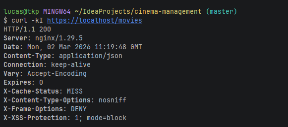
---

### 3.3 — Rate Limiting

**O que foi feito:** Rate limit de 5 req/s por IP com burst de 10. Requisições excedentes recebem HTTP 429.

**Onde está configurado:** `nginx.conf` → `limit_req_zone` (zona `api_limit`) + `limit_req` no `location /`

**Teste — disparar 20 requisições simultâneas:**
```bash
for i in $(seq 1 20); do
  curl -k -s -o /dev/null -w "Req $i: HTTP %{http_code}\n" https://localhost/movies &
done
wait
```
**Ou via script bash incluído no projeto:**
```bash
# Usando o script de teste de rate limit
```bash
bash cinema-management/test-rate-limit.sh
```

**Evidência esperada:** As primeiras ~11 requisições passam (HTTP 200 ou 401), as demais retornam **HTTP 429**.

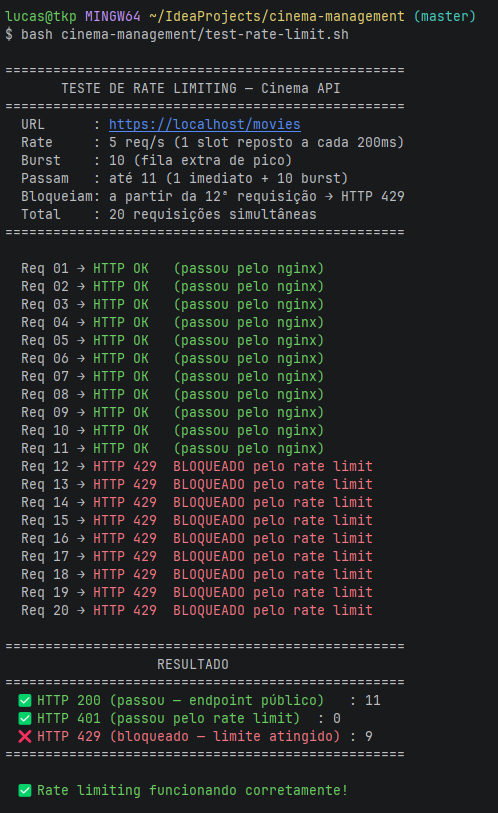
---

### 3.4 — Limite de Payload (1MB)

**O que foi feito:** `client_max_body_size 1m` — requisições com body maior que 1MB são rejeitadas com HTTP 413.

**Onde está configurado:** `nginx.conf` → `client_max_body_size` no bloco `server`

**Teste — enviar payload > 1MB:**
```bash
# Gera arquivo de ~2MB
dd if=/dev/urandom bs=1M count=2 2>/dev/null | base64 > /tmp/big_payload.txt

curl -k -X POST https://localhost/movies \
  -H "Content-Type: application/json" \
  -d @/tmp/big_payload.txt \
  -w "\nHTTP Code: %{http_code}\n"
```

**Evidência esperada:**
```
HTTP Code: 413
```
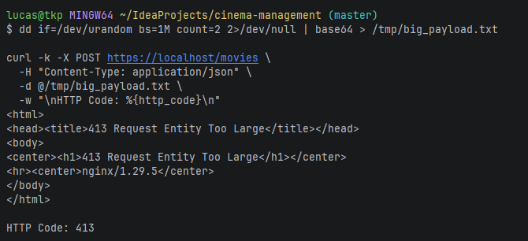

---

### 3.5 — Compressão Gzip

**O que foi feito:** Gzip ativado para `application/json` e `text/plain`. Header `Vary: Accept-Encoding` adicionado automaticamente.

**Onde está configurado:** `nginx.conf` → `gzip on`, `gzip_types`, `gzip_vary`

**Teste:**
```bash
curl -k -H "Accept-Encoding: gzip" -I https://localhost/movies
```

**Evidência esperada (nos headers da resposta):**
```
Content-Encoding: gzip
```
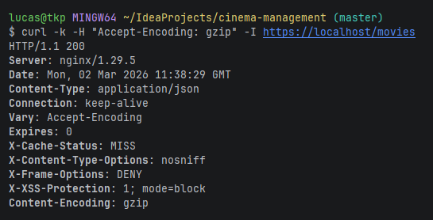

---

### 3.6 — Log Estruturado

**O que foi feito:** Log customizado com IP, método HTTP, URI, status, tempo de resposta do upstream e status do cache.

**Onde está configurado:** `nginx.conf` → `log_format structured`

**Formato:**
```
IP: $remote_addr | Metódo: $request_method | URI: $request_uri | Status: $status | Tempo de resposta: ${upstream_response_time}s | Cache: $upstream_cache_status
```

**Teste — ver logs reais:**
```bash
# Primeiro faça uma requisição para gerar log
curl -k https://localhost/movies

# Depois visualize os logs do container
docker logs cinema-nginx --tail 5
```

**Evidência esperada:**
```
IP: 172.20.0.1 | Metódo: GET | URI: /movies | Status: 200 | Tempo de resposta: 0.032s | Cache: MISS
```
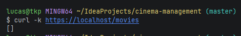
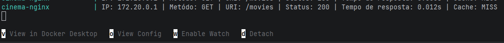
---

### 4.1 — Cache de GET (requisito intermediário)

**O que foi feito:** Respostas GET/HEAD são cacheadas por 10 segundos. Requisições com header `Authorization` fazem bypass do cache (não cacheia dados autenticados).

**Onde está configurado:** `nginx.conf` → `proxy_cache_path`, `proxy_cache`, `proxy_cache_valid 200 10s`, `proxy_cache_bypass $http_authorization`

**Teste — MISS → HIT:**
```bash
# Primeira requisição (MISS — ainda não está em cache)
curl -kI https://localhost/movies 2>&1 | grep X-Cache-Status

# Segunda requisição (HIT — servida do cache)
curl -kI https://localhost/movies 2>&1 | grep X-Cache-Status
```

**Teste — requisição autenticada faz BYPASS:**
```bash
TOKEN=$(curl -k -s -X POST "https://localhost/auth/login?username=admin")

curl -kI -H "Authorization: Bearer $TOKEN" https://localhost/movies 2>&1 | grep X-Cache-Status
```

**Evidência esperada:**
```
X-Cache-Status: MISS
X-Cache-Status: HIT
X-Cache-Status: BYPASS
```
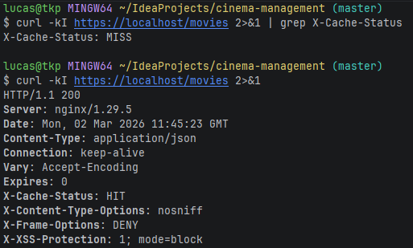
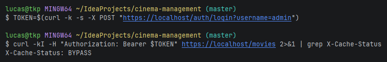
---

### 4.3 — Redirecionamento HTTP → HTTPS (requisito intermediário)

**O que foi feito:** Servidor na porta 80 retorna `301 Moved Permanently` redirecionando para HTTPS. Certificado SSL self-signed gerado automaticamente no build do container Nginx.

**Onde está configurado:**
- `nginx.conf` → bloco `server` porta 80 com `return 301 https://...`
- `nginx.conf` → bloco `server` porta 443 com `ssl_certificate` e `ssl_protocols TLSv1.2 TLSv1.3`
- `nginx/Dockerfile` → geração do certificado via `openssl`

**Teste — redirect 301:**
```bash
curl -v http://localhost/movies 2>&1 | grep -E "< HTTP|Location"
```

**Evidência esperada:**
```
< HTTP/1.1 301 Moved Permanently
< Location: https://localhost/movies
```
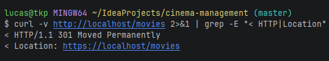

**Teste — handshake SSL/TLS:**
```bash
curl -kv https://localhost/movies 2>&1 | grep -E "SSL|TLS|subject|issuer"
```

**Evidência esperada:**
```
* SSL connection using TLSv1.3
* subject: C=BR; ST=SP; L=SaoPaulo; O=CinemaManagement; CN=localhost
```
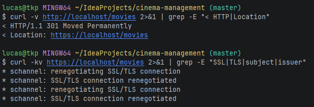

---

### 4.4 — Custom Error Pages (requisito intermediário)

**O que foi feito:** Páginas HTML customizadas para erros 404 e 50x (500, 502, 503, 504).

**Onde está configurado:** `nginx.conf` → `error_page` + `location ^~ /error_pages/` + arquivos em `nginx/error_pages/`

**Teste — erro 404:**
```bash
# Precisa do token pra dar 404 porque o Spring Security devolve 401 
# antes de chegar no endpoint inexistente.
TOKEN=$(curl -k -s -X POST "https://localhost/auth/login?username=admin")
curl -k -H "Authorization: Bearer $TOKEN" https://localhost/rota-inexistente
```

**Evidência esperada:**
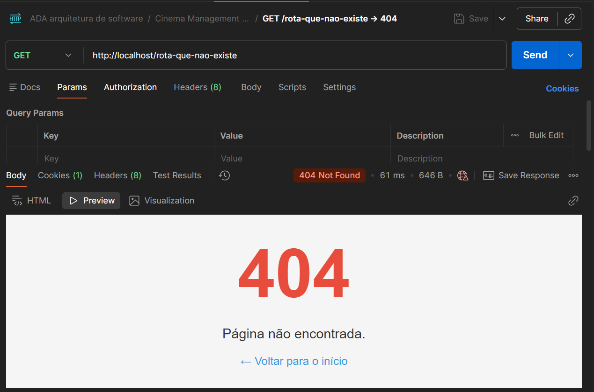

**Teste — erro 500 (endpoint de teste):**
```bash
curl -k https://localhost/test/500
```
** Ou teste 502 parando a API: **
```bash
docker stop cinema-management-api
curl -k https://localhost/movies
# Retorna 502 → Nginx serve a 50x.html
docker start cinema-management-api
```

**Evidência esperada:**
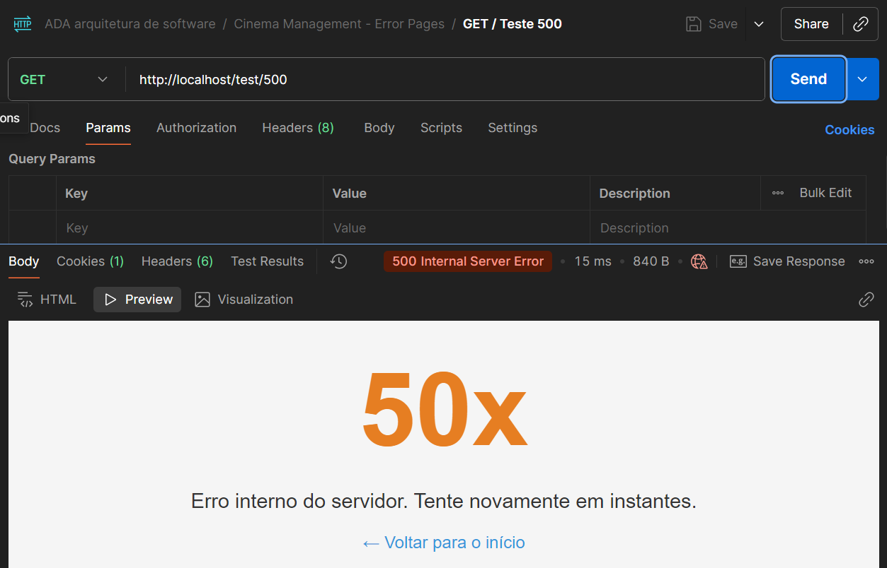
---

## Resumo dos requisitos implementados

| Requisito | Status | Seção no nginx.conf |
|-----------|:------:|---------------------|
| **3.1** Reverse Proxy | ✅ | `upstream` + `proxy_pass` |
| **3.2** Headers de Segurança | ✅ | `add_header X-Content-Type-Options`, `X-Frame-Options`, `X-XSS-Protection` |
| **3.3** Rate Limiting (5r/s, burst 10) | ✅ | `limit_req_zone` + `limit_req` |
| **3.4** Limite de Payload (1MB) | ✅ | `client_max_body_size 1m` |
| **3.5** Compressão Gzip | ✅ | `gzip on` + `gzip_types` |
| **3.6** Log Estruturado | ✅ | `log_format structured` |
| **4.1** Cache de GET (intermediário) | ✅ | `proxy_cache_path` + `proxy_cache` + `proxy_cache_bypass` |
| **4.3** HTTPS / Redirect HTTP→HTTPS (intermediário) | ✅ | `return 301 https://` + `ssl_certificate` |
| **4.4** Custom Error Pages (requisito intermediário) | ✅ | `error_page` + `location /error_pages/` |

---

## Fluxo completo de teste (criar filme → criar sessão → comprar ingresso)

> As entidades usam **UUID** como identificador. Os comandos abaixo capturam os IDs com `grep` + `sed`, disponíveis nativamente no Git Bash sem nenhuma instalação extra.

```bash
# 1. Login (obter token JWT)
TOKEN=$(curl -k -s -X POST "https://localhost/auth/login?username=admin")
echo "Token: $TOKEN"

# 2. Criar filme (captura o UUID retornado)
MOVIE_ID=$(curl -k -s -X POST https://localhost/movies \
  -H "Authorization: Bearer $TOKEN" \
  -H "Content-Type: application/json" \
  -d '{"title": "Interestelar", "durationInMinutes": 169}' \
  | grep -o '"id":"[^"]*"' | head -1 | sed 's/"id":"//;s/"//')
echo "Movie ID: $MOVIE_ID"

# 3. Criar sessão para o filme (usa o UUID do filme)
SESSION_ID=$(curl -k -s -X POST https://localhost/sessions \
  -H "Authorization: Bearer $TOKEN" \
  -H "Content-Type: application/json" \
  -d "{\"movieId\": \"$MOVIE_ID\", \"room\": \"Sala 1\", \"startsAt\": \"2026-12-31T20:00:00\"}" \
  | grep -o '"id":"[^"]*"' | head -1 | sed 's/"id":"//;s/"//')
echo "Session ID: $SESSION_ID"

# 4. Comprar ingresso (usa o UUID da sessão)
curl -k -s -X POST https://localhost/tickets \
  -H "Authorization: Bearer $TOKEN" \
  -H "Content-Type: application/json" \
  -d "{\"sessionId\": \"$SESSION_ID\", \"seat\": \"A1\", \"customerName\": \"Lucas\"}"

# 5. Listar ingressos
curl -k -s -H "Authorization: Bearer $TOKEN" https://localhost/tickets
```

---

## Arquivo `nginx.conf` comentado

O arquivo `nginx/nginx.conf` está **inteiramente comentado** linha a linha, explicando cada diretiva e sua função. Os comentários cobrem:

- `worker_processes` e `worker_connections`
- Formato de log estruturado (`log_format`)
- Rate limiting (`limit_req_zone`, `limit_req`)
- Compressão Gzip (`gzip`, `gzip_types`, `gzip_vary`)
- Cache de proxy (`proxy_cache_path`, `proxy_cache`, `proxy_cache_valid`)
- Redirect HTTP → HTTPS
- SSL/TLS (`ssl_certificate`, `ssl_protocols`, `ssl_ciphers`)
- Limite de payload (`client_max_body_size`)
- Headers de segurança (`X-Content-Type-Options`, `X-Frame-Options`, `X-XSS-Protection`)
- Proxy pass e headers de repasse (`proxy_set_header`)
- Páginas de erro customizadas (`error_page`)

---

## Estrutura do projeto

```
cinema-management/
├── docker-compose.yml          # Orquestração dos containers
├── Dockerfile                  # Build da API Spring Boot (multi-stage)
├── mvnw / mvnw.cmd             # Maven wrapper
├── pom.xml                     # Dependências do projeto
├── test-rate-limit.sh          # Script de teste de rate limiting
├── docs/
│   └── requirements.md         # Requisitos do sistema
├── nginx/
│   ├── Dockerfile              # Build do container Nginx
│   ├── nginx.conf              # Configuração completa (comentada)
│   ├── error_pages/
│   │   ├── 404.html            # Página de erro 404 customizada
│   │   └── 50x.html            # Página de erro 50x customizada
│   └── logs/
│       ├── access.log
│       └── error.log
└── src/
    └── main/
        └── java/org/example/cinemamanagement/
            ├── CinemaManagementApplication.java
            ├── infrastructure/security/   # JWT + Spring Security
            ├── movies/                    # Módulo de filmes
            ├── sessions/                  # Módulo de sessões
            ├── tickets/                   # Módulo de ingressos
            └── shared/                    # Exceções e handlers globais
```

---

## Autor

Lucas Oliveira Nadier
